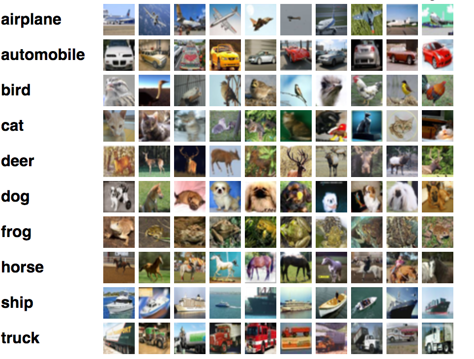

```{r setup, echo = FALSE}

knitr::opts_chunk$set(
  echo = TRUE,
  message = FALSE,
  warning = FALSE,
  fig.align = 'center',
  dev = c("svg"),
  dpi = 500
)

htmltools::img(
  src = knitr::image_uri(here::here("01_data", "img", "logo.png")),
  alt = 'logo',
  style = 'position:absolute; top:0; right:0; padding:45px;'
)

ggplot2::theme_set(ggplot2::theme_bw())

```

Dieses Dokument beschreibt die Ausarbeitung der zweiten Aufgabe des Abschlussprojekts (Machine Learning ILV W2020 an der Fachhochschule Wiener Neustadt). Es enthält sowohl den R-Code zur Lösung der Aufgabenstellung als auch die entsprechende Dokumentation beziehungsweise Beschreibung.

Im Folgenden werden Deep Learning-Modelle mithilfe des `keras`-Packages auf das CIFAR-10-Dataset trainiert. Der vorliegende Workflow soll nicht als Best Practice verstanden werden, um ein möglichst gutes Deep Learning-Modell zu trainineren, sondern stellt lediglich eine unsystematische Exploration von Modellparametern und -merkmalen dar. Unter anderen werden folgende Aspekte in diesem Zusammenhang nicht berücksichtigt bzw. behandelt:

* *systematische* Variation von Parametern (z.B. mittels Grid Search wie bei vielen Machine Learning-Workflows üblich)
* die Verwendung eines Validation Sets für das Training des Modells und damit verbunden die Verwendung von Early Stopping beim Modell-Training. Stattdessen wird jedes Modell nur mit dem jeweiligen Test Set evaluiert, was in der Praxis nicht empfehlenswert ist.
* Zusätzliche Abstraktion häufig verwendeter Workflows in Funktionen.

# Import der benötigten Pakete

```{r}
library(keras)
```

# Vorbereitung des Datensatzes

Der CIFAR10-Datensatz enthält Bilder eingeteilt in 10 Klassen mit einer Auflösung von 32 x 32 Pixeln.



Um rasch verschiedene Modellarchitekturen testen zu können, wird ein Subset des CIFAR-10-Datensatzes verwendet. Um abschließend ein Modell mit dem Gesamtdatensatz zu trainieren und zu testen, wird auch der entsprechende Gesamtdatensatz vorbereitet. 

```{r}
cifar10 = dataset_cifar10()

train_data <- cifar10$train$x
test_data <- cifar10$test$x

train_label <- cifar10$train$y
test_label <- cifar10$test$y

train_data <- train_data / 255
test_data <- test_data / 255

# Gesamt-Datensatz
train_labelc <- to_categorical(train_label, num_classes = 10)
test_labelc <- to_categorical(test_label, num_classes = 10)

# Subset
subset_train <- 5000
subset_test  <- 1000

train_data_small <- train_data[1:subset_train,,,]
train_label_small <- train_label[1:subset_train]

test_data_small <- test_data[1:subset_test,,,]
test_label_small <- test_label[1:subset_test]

train_labelc_small <-
  to_categorical(train_label_small, num_classes = 10)
test_labelc_small <-
  to_categorical(test_label_small, num_classes = 10)

```

# Modell-Tuning

## Initiales Modell

Zunächst wird das vorgegebene Modell initiiert, trainiert und evaluiert.

### Definition und Kompilierung des Modells:

```{r}
cnn_model_1 <- keras_model_sequential() %>% 
 
  layer_conv_2d( filter = 32, kernel_size = c(3,3), padding = "same", input_shape = c(32, 32, 3)) %>%
  layer_activation("relu") %>%

  layer_conv_2d(filter = 32, kernel_size = c(3,3)) %>%
  layer_activation("relu") %>%

  layer_max_pooling_2d(pool_size = c(2,2)) %>%
  layer_dropout(0.25) %>%

  layer_flatten() %>%
  layer_dense(256) %>%
  layer_activation("relu") %>%
  layer_dropout(0.5) %>%

  layer_dense(256) %>%
  layer_activation("relu") %>%
  layer_dropout(0.5) %>%

  layer_dense(10) %>%
  layer_activation("softmax")

cnn_model_1 %>% compile(
  loss = "categorical_crossentropy",
  optimizer = optimizer_rmsprop(lr = 0.0001, decay = 1e-6),
  metrics = "accuracy"
)
```

### Training des Modells (inklusive Aufzeichnung der Berechnungszeit und Evaluierung mittels Test Set):

```{r, results = "hide"}
start_t1 = proc.time()

m1_hist <- cnn_model_1 %>% fit(
  train_data_small, train_labelc_small,
  batch_size = 32,
  epochs = 5,
  shuffle = TRUE
)

end_t1 <- proc.time()
diff_t1 <- end_t1 - start_t1

m1_acc <- cnn_model_1 %>% evaluate(test_data_small, test_labelc_small)
```

```{r}
m1_hist
plot(m1_hist) +
  ggplot2::geom_point(color = "#06c7b7") +
  ggplot2::geom_line(color = "#06c7b7")
```

Das initiale Modell weist Training Accuracy von `r round(m1_hist$metrics$accuracy[5], 2)` und eine Testing Accuracy von `r round(m1_acc[[2]], 2)` auf. Das Training des Modells über fünf Epochen hat `r round(diff_t1[[3]], 2)` Sekunden benötigt.

## Optimizer anpassen

Im Folgenden werden einige Parameter des Optimizers varriiert. Der Optimizer selbst (`rmsprop`) gilt allgemein als gute Wahl für das Training von Convolution Neural Networks, daher wird dieser nicht varriiert (Alternativen wäre z.B. der `adam`-Optimizer), wohl aber dessen Parameter (in diesem Beispiel `learning_rate` und `decay`).

* `learning_rate`: Wie groß Schritte werden beim Update der Gewichte gemacht?
* `decay`: Werden die Schritte im Laufe des Trainings kleiner und wenn ja, um wie viel?

Auffällig beim Modell-Training: Das Modell macht bei den Updates zwischen den Epochen relativ kleine Schritte (nicht im `rmarkdown`-Output dargestellt). Daher wird zunächst versucht, ausschließlich über Anpassung der Learning Rate das Modell zu verbessern. In diesem Fall wird die `learning_rate` von 0.0001 auf 0.001 gesetzt. Außerdem wird der `decay` verringert von 1e-6 auf 1e-7.

### Definition und Kompilierung des Modells:

```{r}
# Das erste Modell bleibt von seiner Architektur unverändert, daher reicht es aus, das Model zu klonen
cnn_model_2 <- clone_model(cnn_model_1)
  
cnn_model_2 %>% compile(
  loss = "categorical_crossentropy",
  optimizer = optimizer_rmsprop(lr = 0.001, decay = 1e-7),
  metrics = "accuracy"
)
```

### Training des Modells (inklusive Aufzeichnung der Berechnungszeit und Evaluierung auf Test Set):

```{r}
start_t2 = proc.time()

m2_hist <- cnn_model_2 %>% fit(
  train_data_small, train_labelc_small,
  batch_size = 32,
  epochs = 5,
  shuffle = TRUE
)

end_t2 <- proc.time()
diff_t2 <- end_t2 - start_t2

m2_acc <- cnn_model_2 %>% evaluate(test_data_small, test_labelc_small)
```

```{r}
m2_hist
plot(m2_hist) +
  ggplot2::geom_point(color = "#06c7b7") +
  ggplot2::geom_line(color = "#06c7b7")
```


Das zweite Modell weist eine Training Accuracy von `r round(m2_hist$metrics$accuracy[5], 2)` und eine Testing Accuracy von `r round(m2_acc[[2]], 2)` auf. Das Training des Modells über fünf Epochen hat `r round(diff_t2[[3]], 2)` Sekunden benötigt. Die Anpassungen des Optimizers (`learning_rate` und `decay`) haben jedenfalls eine Verbesserung hinsichtlich der Test Accuracy erzielt. Die Zeit zum Training bleibt unverändert.

## Anpassen der Batchsize

Die `batchsize` beschreibt, wie viele Samples pro Step zum Update der Gewichte herangezogen werden. Sie kann ("theoretisch") auch Auswirkungen auf die Modellperformance haben. Die `batchsize` wird im folgenden Beispiel erhöht von 32 auf 64.

### Definition und Kompilierung des Modells:

```{r}
# Wieder ist einen Klonen des ersten Modells ausreichend
cnn_model_3 <- clone_model(cnn_model_1)
  
cnn_model_3 %>% compile(
  loss = "categorical_crossentropy",
  optimizer = optimizer_rmsprop(lr = 0.001, decay = 1e-7),
  metrics = "accuracy"
)
```

### Training des Modells (inklusive Aufzeichnung der Berechnungszeit):

```{r}
start_t3 = proc.time()

m3_hist <- cnn_model_3 %>% fit(
  train_data_small, train_labelc_small,
  batch_size = 64,
  epochs = 5,
  shuffle = TRUE
)

end_t3 <- proc.time()
diff_t3 <- end_t3 - start_t3

m3_acc <- cnn_model_3 %>% evaluate(test_data_small, test_labelc_small)
```

```{r}
m3_hist
plot(m3_hist) +
  ggplot2::geom_point(color = "#06c7b7") +
  ggplot2::geom_line(color = "#06c7b7")
```


Das dritte Modell weist eine Training Accuracy von `r round(m3_hist$metrics$accuracy[5], 2)` und eine Testing Accuracy von `r round(m3_acc[[2]], 2)` auf. Das Training des Modells über fünf Epochen hat `r round(diff_t3[[3]], 2)` Sekunden benötigt.

In diesem Fall bringt eine größere Batchsize keine bessere Test Accuracy im Vergleich zu vorher. Erwähnenswert ist allerdings, dass die Berechnungszeit geringer ist. Aufgrund der minimal besseren Performance bei kleineren `batchsize` wird für die folgende Modelle mit einer `batchsize` von 32 weitergearbeitet.

## Epochen steigern

Beim Training der vorherigen Modell (mit unterschiedlichen Parametern) zeigt sich insgesamt, dass nach den fünf Epochen noch keine Konvergenz erkennbar ist erkennbar ist. Daher macht es Sinn, dasselbe Modell über mehr Epochen zu traininieren und sich dann seine Performance zu betrachten.

### Definition und Kompilierung des Modells:

```{r}
# Wieder Klonen des ersten Modells ausreichend
cnn_model_4 <- clone_model(cnn_model_1)

cnn_model_4 %>% compile(
  loss = "categorical_crossentropy",
  optimizer = optimizer_rmsprop(lr = 0.001, decay = 1e-7),
  metrics = "accuracy"
)
```

### Training des Modells (inklusive Aufzeichnung der Berechnungszeit):

```{r}
start_t4 = proc.time()

m4_hist <- cnn_model_4 %>% fit(
  train_data_small, train_labelc_small,
  batch_size = 32,
  epochs = 30,
  shuffle = TRUE
)

end_t4 <- proc.time()
diff_t4 <- end_t4 - start_t4

m4_acc <- cnn_model_4 %>% evaluate(test_data_small, test_labelc_small)
```

```{r}
m4_hist
plot(m4_hist) +
  ggplot2::geom_point(color = "#06c7b7") +
  ggplot2::geom_line(color = "#06c7b7")
```


Das vierte Modell weist eine Training Accuracy von `r round(m4_hist$metrics$accuracy[5], 2)` und eine Testing Accuracy von `r round(m4_acc[[2]], 2)` auf. Das Training des Modells über dreißig Epochen hat `r round(diff_t4[[3]], 2)` Sekunden benötigt. 

Das Training über 30 Epochen hat die Performance sowohl in Bezug auf das Training Set als auch auf das Test Set verbessert. Offensichtlich geht das Training über mehr Epochen auch mit einer wesentlichen längeren Trainingszeit einher. Es lässt sich auch erkennen, dass das Modell am Ende des Trainings zu konvergieren scheint und keine nennenswerten Performance-Fortschritte mehr macht. Das weist daraufhin, dass das aktuelle Modell eine zu niedrige "Representational Power" aufweist und ein komplexeres Modell (mit mehr Layers und Knoten) benötigt wird, um das vorliegende Klassifikationsproblem zu lösen. Die große Diskrepanz zwischen Training Accuracy und Test Accuracy weist außerdem daraufhin, dass es ggf. schon zu einem Overfitting des Modells kommt und dass (zusätzliche) Maßnahmen zur Regualisierung mitbedacht werden müssen.

## Ein neues Modell mit mehr Layern

Um die angesprochenen Limitationen des bisherigen Modells zu überwinden, wird im Folgenden ein Modell eingeführt, das wesentlich mehr Layer (und Parameter) als das bisherige Modell aufweist.

Dieses Modell ist Resultat eines umfangreicheren Iterationsprozesses, der aufgrund des begrenzten Rahmens der vorliegenden Ausarbeitung nicht im Detail beschrieben wird. Im Folgenden sind die wichtigsten Merkmale des Modells zusammgefasst.

* Das Modell verwendet insgesamt sechs Convolutional Layers mit einer zunehmenden Anzahl von Filtern.
* Zwischen in einzelnen Convolutional Layers sind in der Regel Max Pooling Layer geschaltet (Ausnahme: die ersten zwei Convolutional Layers im Netzwerk).
* Zum Abschluss werden die Outputs aus den Convolutional Layers in einen Vektor umgewandelt und zwei aufeinander folgenden Dense Layers übergeben.
* Das Output Layer verwendet wie gehabt eine `softmax`-Aktivierung.
* Um den Trainingsprozess zu stabilisieren und zu beschleunigen, wird für die Initialisierung der Gewichte in allen Layern die uniforme Initialisierung nach He et al., die dafür sorgt dass die Gewichte zum Zeitpunkt der Initialiserung einer bestimmten Verteilung folgen. Außerdem wird für jedes Layer ein Batch-Normalization vorgenommen, die ebenso zur Stabilisierung des Trainings und Vanishing uoder Exploding Gradients vermeidet. Diese Techniken werden bei zunehmender Tiefe des Netzwerkes immer wichtiger.
* Das Modell berücksichtigt noch keine Regularisierungen (z.B. Dropout oder Weight Decay). 
* Der Decay des `rmsprop`-Optimizers ist außerdem auf 0 gesetzt, da sich gezeigt hat, dass diese Konfiguration für das vorliegende Modell die besseren Ergebnisse erzielt.

### Definition und Kompilierung des Modells:

```{r}
cnn_model_5 <- keras_model_sequential() %>% 
  layer_conv_2d(filters = 32, kernel_size = c(3, 3), activation = "relu", kernel_initializer = "he_uniform",
                input_shape = c(32, 32, 3), padding = "same") %>% 
  layer_batch_normalization() %>% 
  layer_conv_2d(filters = 32, kernel_size = c(3, 3), activation = "relu", kernel_initializer = "he_uniform",
                padding = "same") %>% 
  layer_batch_normalization() %>% 
  layer_max_pooling_2d(pool_size = c(2, 2)) %>% 
  layer_conv_2d(filters = 64, kernel_size = c(3, 3), padding = "same", activation = "relu", kernel_initializer = "he_uniform") %>%
  layer_batch_normalization() %>% 
  layer_max_pooling_2d(pool_size = c(2, 2)) %>% 
  layer_conv_2d(filters = 128, kernel_size = c(3, 3), padding = "same", activation = "relu", kernel_initializer = "he_uniform") %>%
  layer_batch_normalization() %>% 
  layer_max_pooling_2d(pool_size = c(2, 2)) %>% 
  layer_conv_2d(filters = 256, kernel_size = c(3, 3), padding = "same", activation = "relu", kernel_initializer = "he_uniform") %>%
  layer_batch_normalization() %>% 
  layer_max_pooling_2d(pool_size = c(2, 2)) %>% 
  layer_conv_2d(filters = 256, kernel_size = c(3, 3), padding = "same", activation = "relu", kernel_initializer = "he_uniform") %>%
  layer_batch_normalization() %>% 
  layer_max_pooling_2d(pool_size = c(2, 2)) %>% 
  layer_flatten() %>% 
  layer_dense(units = 1024, activation = "relu", kernel_initializer = "he_uniform") %>% 
  layer_batch_normalization() %>% 
  layer_dense(units = 128, activation = "relu", kernel_initializer = "he_uniform") %>% 
  layer_batch_normalization() %>% 
  layer_dense(units = 10, activation = "softmax")

cnn_model_5 %>% compile(
  loss = "categorical_crossentropy",
  optimizer = optimizer_rmsprop(lr = 0.001, decay = 0),
  metrics = "accuracy"
)
```

### Training des Modells (inklusive Aufzeichnung der Berechnungszeit):

```{r}
start_t5 = proc.time()

m5_hist <- cnn_model_5 %>% fit(
  train_data_small, train_labelc_small,
  batch_size = 32,
  epochs = 30,
  shuffle = TRUE
)

end_t5 <- proc.time()
diff_t5 <- end_t5 - start_t5

m5_acc <- cnn_model_5 %>% evaluate(test_data_small, test_labelc_small)
```

```{r}
m5_hist
plot(m5_hist) +
  ggplot2::geom_point(color = "#06c7b7") +
  ggplot2::geom_line(color = "#06c7b7")
```

Das fünfte Modell weist eine Training Accuracy von `r round(m5_hist$metrics$accuracy[5], 2)` und eine Testing Accuracy von `r round(m5_acc[[2]], 2)` auf. Das Training des Modells über 30 Epochen hat `r round(diff_t5[[3]], 2)` Sekunden benötigt. Hier wird deutlich, dass das neue Modell aufgrund seiner höheren Komplexität auch mit längerer Trainingszeit einhergeht.

Die höhere Training Accuracy weist daraufhin, dass das neue Modell eine ausreichende Representational Power besitzt, um das vorliegende Klassifikationsproblem zu lösen.

Allerdings ist die Performance des Modells (immer noch) vergleichsweise schlecht auf das Test Set. Das liegt vermutlich daran, dass das Modell wenige regulariseriende Mechanismen aufweist und daher stark overfittet. Es wird im Folgenden versucht, dieses Problem durch die Einführung von `dropout` zu lösen.

## Das neue Modell mit Dropout

Durch `dropout` wird zufällig ein bestimmter Anteil an Gewichten in einem Layer auf Null gesetzt. Dadurch wird in vielen Fällen Overfitting effektiv verhindert. Im vorliegenden Modell wird der `dropout` nach jedem Pooling Layer sowie nach jedem Hidden Dense Layer angewandt. Es gibt außerdem noch weitere Möglichkeiten, um Dropout umzusetzen, z.B. Spatial Dropout, bei dem zufällig ganze Feature Maps der Convolutional Layers auf 0 gesetzt werden. Im Rahmen des vorliegenden Modells wird nur der Dropout nach den Max Pooling Layers angewandt.

Es ist anzumerken, dass die Kombination von Dropout und Batch Normalization häufig keine besonders guten Ergebnisse liefert, in diesem Fall aber schon (Iterationsprozess hier nicht im Detail dargestellt).

### Definition und Kompilierung des Modells:

```{r}
cnn_model_6 <- keras_model_sequential() %>% 
  layer_conv_2d(filters = 32, kernel_size = c(3, 3), activation = "relu", kernel_initializer = "he_uniform",
                input_shape = c(32, 32, 3), padding = "same") %>% 
  layer_batch_normalization() %>% 
  layer_conv_2d(filters = 32, kernel_size = c(3, 3), activation = "relu", kernel_initializer = "he_uniform",
                padding = "same") %>% 
  layer_batch_normalization() %>% 
  layer_max_pooling_2d(pool_size = c(2, 2)) %>% 
  layer_dropout(0.3) %>% 
  layer_conv_2d(filters = 64, kernel_size = c(3, 3), padding = "same", activation = "relu", kernel_initializer = "he_uniform") %>%
  layer_batch_normalization() %>% 
  layer_max_pooling_2d(pool_size = c(2, 2)) %>% 
  layer_dropout(0.3) %>% 
  layer_conv_2d(filters = 128, kernel_size = c(3, 3), padding = "same", activation = "relu", kernel_initializer = "he_uniform") %>%
  layer_batch_normalization() %>% 
  layer_max_pooling_2d(pool_size = c(2, 2)) %>% 
  layer_dropout(0.3) %>% 
  layer_conv_2d(filters = 256, kernel_size = c(3, 3), padding = "same", activation = "relu", kernel_initializer = "he_uniform") %>%
  layer_batch_normalization() %>% 
  layer_max_pooling_2d(pool_size = c(2, 2)) %>% 
  layer_dropout(0.3) %>% 
  layer_conv_2d(filters = 256, kernel_size = c(3, 3), padding = "same", activation = "relu", kernel_initializer = "he_uniform") %>%
  layer_batch_normalization() %>% 
  layer_max_pooling_2d(pool_size = c(2, 2)) %>% 
  layer_dropout(0.3) %>% 
  layer_flatten() %>% 
  layer_dense(units = 1024, activation = "relu", kernel_initializer = "he_uniform") %>% 
  layer_batch_normalization() %>% 
  layer_dropout(0.3) %>% 
  layer_dense(units = 128, activation = "relu", kernel_initializer = "he_uniform") %>% 
  layer_batch_normalization() %>% 
  layer_dropout(0.3) %>% 
  layer_dense(units = 10, activation = "softmax")

cnn_model_6 %>% compile(
  loss = "categorical_crossentropy",
  optimizer = optimizer_rmsprop(lr = 0.001, decay = 0),
  metrics = "accuracy"
)
```

### Training des Modells (inklusive Aufzeichnung der Berechnungszeit):

```{r}
start_t6 = proc.time()

m6_hist <- cnn_model_6 %>% fit(
  train_data_small, train_labelc_small,
  batch_size = 32,
  epochs = 30,
  shuffle = TRUE
)

end_t6 <- proc.time()
diff_t6 <- end_t6 - start_t6

m6_acc <- cnn_model_6 %>% evaluate(test_data_small, test_labelc_small)
```

```{r}
m6_hist
plot(m6_hist) +
  ggplot2::geom_point(color = "#06c7b7") +
  ggplot2::geom_line(color = "#06c7b7")
```

Das sechste Modell weist eine Training Accuracy von `r round(m6_hist$metrics$accuracy[5], 2)` und eine Testing Accuracy von `r round(m6_acc[[2]], 2)` auf. Das Training des Modells über 30 Epochen hat `r round(diff_t6[[3]], 2)` Sekunden benötigt. 

Insgesamt erreicht das sechste Modell somit die beste Performance auf das test Set bisher. Obwohl diese Performance offensichtlich noch nicht perfekt ist, ist zu bedenken, dass all Modelle bisher auf ein relativ kleine Datenmenge und über relativ wenige Epochen trainiert wurden. Daher soll abschließend ein Modell über auf das Gesamtdatenset und über 100 Epochen trainiert werden

## Das finale Modell auf den Gesamtdatensatz angewandt

Da das Training des siebten Modells (selbe Architektur und Parameter wie das sechste Modell) auf den Gesamtdatensatz sehr lange dauert (trotz Verwendung eines GPUs) und beim Knitten des `rmarkdown`-Files eine ernstzunehmende Fehlerquelle darstellt, wird das zuvor trainierte und gespeicherte Modell nur von der Festplatte geladen und nicht im `rmarkdown` trainiert. Das siebte Modell wurde zuvor wie das sechste kompiliert und trainiert (im Unterschiede mit dem Gesamt-Datensatz und 100 Epochen).

### Laden des Modells:

```{r}
cnn_model_7 <- load_model_tf(here::here("01_data", "cnn_model_7"))
```

### Ein Blick aufs Modell:

```{r}
cnn_model_7
```

### Performance aufs Test Set:

```{r}
m7_acc <- cnn_model_7 %>% evaluate(test_data, test_labelc)
```

Das finale Modell (auf den Gesamtdatensatz trainiiert) erreicht eine Test Accuracy von `r m7_acc[[2]]`. Nicht so schlecht! Die Trainingszeit lässt sich anhand des `rmarkdown`-Files nicht nachvollziehen (da das Modell zuvor separat trainiert und dann von der Festplatte geladen wurde), beträgt aber auf der verwendeten lokalen Maschine ca. 30 Minuten.

# Zusammenfassung und Ausblick

Ausgehend vom initialen Modell wurden verschiedene Parameter (z.B. `learning_rate`, `batchsize` und Anzahl der `epochs`) eines Deep Learning-Modells zur Klassifikation des CIFAR10-Datensatzes variiert. Die relativ niedrige Training Accuracy des initialen Modells war ein Hinweis darauf, dass das Modell eine unzureichende "Representional Power" aufweist. Daher wurde ein neues Modell eingeführt, was wesentlich mehr Layer besitzt und unter anderem durch Batch Normalization das Training stabilisiert. Um nun Overfitting zu vermeiden wurde außerdem Dropout eingeführt. Das abschließende Modell wurde auf den Gesamtdatensatz trainiiert und erreicht eine Test Accuracy von immerhin 0.86. Hinsichtlich der Berechnungsdauer hat sich gezeigt, dass vor allem die Tiefe / Komplexität des Netzwerk, die Anzahl der Epochen und der Umfang der Trainingsdaten die größten Auswirkungen zeigen.

Wie erwähnt wurden viele Aspekte eines "Best Practice-orientierten ML-Workflows" in der vorliegenden Ausarbeitung nicht behandelt (z.B. Validation Set, Betrachtung von Metriken abseits der Accuracy, Detailbetrachtung falsch klassifizierter Samples).

Um das finale Modell weiter zu verbessern, kommen unter anderem folgende Möglichkeiten in Frage:

* zusätzliches Training des Modell via Data Augmentation
* weitere Layer (in sinnvoller Weise) dem Modell hinzufügen (auch einführung von Residual Connections)
* ggf. weitere Anpassungen z.B. vom Optimizer oder Ausprobieren alternativer Regularisierungsverfahren (z.B. Weight Decay)
* die Benutzung vortrainierte Modelle ("Transfer Learning")

# Literatur

* Chollet, F., & Allaire, J. J. (2018). Deep Learning with R, Manning Publications.
* He, K., Zhang, X., Ren, S., & Sun, J. (2015). Delving deep into rectifiers: Surpassing human-level performance on imagenet classification. In Proceedings of the IEEE international conference on computer vision (pp. 1026-1034).
* Li, X., Chen, S., Hu, X., & Yang, J. (2019). Understanding the disharmony between dropout and batch normalization by variance shift. In Proceedings of the IEEE/CVF Conference on Computer Vision and Pattern Recognition (pp. 2682-2690).
